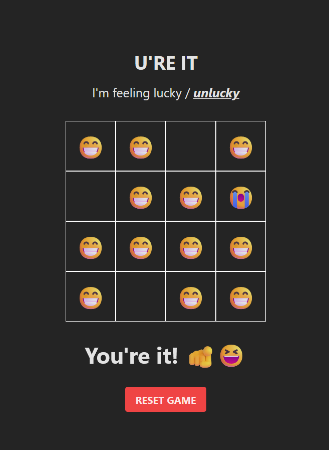

## U're It

A luck based party game played between friends to select the fortunate/unfortunate one - built with Vue, TypeScript and Tailwind CSS.

Check it out here: [https://better-url.vercel.app/](https://better-url.vercel.app/)

### Features

- 4x4 grid
- Select the mode to find the lucky one or the unlucky one
- [ ] grid size selection

### Technologies

### How to run

- Clone this repository to your local system.
- cd to the project directory on terminal and type `npm install` followed by `npm run dev`
- Go to url: http://localhost:5173 in your browser to check out the app.

### Preview

  

### Support Development

  

